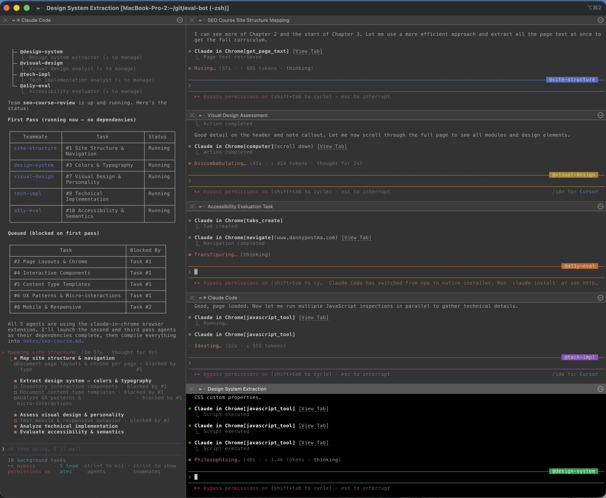

# design-research

A [Claude Code skill](https://code.claude.com/docs/en/skills) that runs a comprehensive design research audit on any website using a coordinated team of browser-automation agents.

Give it a URL and it dispatches 10 specialized agents across three parallel passes to document every aspect of the site's design: structure, layout, colors, typography, components, content templates, UX patterns, visual personality, responsive behavior, technical stack, and accessibility. The lead agent synthesizes all findings into a single structured markdown report.



## Prerequisites

### 1. Claude Code

Install Claude Code (version 2.0.73+):

```bash
npm install -g @anthropic-ai/claude-code
```

### 2. Claude in Chrome extension

This skill requires the **Claude in Chrome** browser extension for browser automation. Every research agent uses Chrome to navigate, screenshot, inspect DOM, extract styles, and interact with the target site.

**Install it from the Chrome Web Store:**

[Claude in Chrome extension](https://chromewebstore.google.com/detail/claude/fcoeoabgfenejglbffodgkkbkcdhcgfn)

Requirements:
- Google Chrome or Microsoft Edge
- Extension version 1.0.36 or higher
- A direct Anthropic plan (Pro, Max, Teams, or Enterprise) — third-party providers (Bedrock, Vertex) are not supported for Chrome integration

### 3. tmux (recommended for agent teams)

Agent teams work best in **split-pane mode** where each agent gets its own terminal pane. This requires tmux.

**Install tmux:**

```bash
# macOS
brew install tmux

# Ubuntu/Debian
sudo apt install tmux

# Arch
sudo pacman -S tmux
```

**If you use iTerm2 on macOS** (recommended): start tmux in iTerm2 integration mode for the best experience:

```bash
tmux -CC
```

This gives you native iTerm2 tabs/splits instead of tmux's built-in UI. See the [agent teams docs](https://code.claude.com/docs/en/agent-teams) for more on display modes.

### 4. Enable agent teams

Agent teams are experimental and disabled by default. Enable them by adding this to your `~/.claude/settings.json`:

```json
{
  "env": {
    "CLAUDE_CODE_EXPERIMENTAL_AGENT_TEAMS": "1"
  }
}
```

Or set the environment variable directly:

```bash
export CLAUDE_CODE_EXPERIMENTAL_AGENT_TEAMS=1
```

## Installation

Clone this repo and copy the skill into your Claude Code skills directory:

```bash
# For all projects (personal skills)
mkdir -p ~/.claude/skills
cp -r skills/design-research ~/.claude/skills/

# Or for a specific project only
mkdir -p /path/to/your/project/.claude/skills
cp -r skills/design-research /path/to/your/project/.claude/skills/
```

Verify it's installed by running `claude` and typing `/design-research` — you should see it in the skill list.

## Usage

### Starting Claude Code

Start Claude Code with the `--chrome` flag and `--dangerously-skip-permissions` (required so agents can use browser tools without per-action approval prompts):

```bash
claude --chrome --dangerously-skip-permissions
```

If you're using tmux for split-pane agent display (recommended):

```bash
# Start a tmux session first (use -CC for iTerm2 integration)
tmux -CC

# Then inside tmux:
claude --chrome --dangerously-skip-permissions
```

### Running the skill

Invoke the skill with the target URL:

```
/design-research https://example.com
```

Or describe what you want:

```
Run a design research audit on https://example.com and write findings to notes/example-research.md
```

### What happens

1. Claude creates an agent team
2. **First pass** — 5 agents run in parallel (no dependencies):
   - Site Structure & Navigation
   - Design System (Colors & Typography)
   - Visual Design & Personality
   - Technical Implementation
   - Accessibility & Semantics
3. **Second pass** — 4 agents run in parallel (after site structure is mapped):
   - Page Layouts & Chrome
   - Interactive Components Inventory
   - Content Type Templates
   - UX Patterns & Micro-interactions
4. **Third pass** — 1 agent (after page layouts are documented):
   - Mobile & Responsive Behavior
5. All findings are compiled into a single structured markdown report

### Output

The output is a comprehensive markdown document covering all 10 research areas with:
- Exact color values (hex, RGB, Tailwind equivalents)
- Typography scales with font families, sizes, weights
- Complete component inventories
- Page layout diagrams with CSS measurements
- Content flow documentation per page type
- Responsive breakpoint behavior
- Technical architecture summary
- Accessibility grade and recommendations

## Customization

Edit `skills/design-research/SKILL.md` to:
- Add or remove research areas
- Change the output format
- Adjust the number of parallel agents
- Modify the dependency chain between tasks
- Add domain-specific analysis (e.g., e-commerce checkout flow, SaaS onboarding)

## Tips

- **Chrome must be open** with the extension active before starting Claude
- **You must be logged in** to the target site if it requires authentication — agents share your browser's login state
- **Expect ~10-15 minutes** for a full audit depending on site complexity
- **Token usage is significant** — each agent has its own context window. A full 10-agent audit uses roughly 10x the tokens of a single session
- If a connection drops, run `/chrome` inside Claude to reconnect
- The skill works best on sites with multiple distinct page types

## How it works

This skill uses Claude Code's [agent teams](https://code.claude.com/docs/en/agent-teams) feature to coordinate multiple Claude instances. Each agent:

1. Opens a new Chrome tab via the Claude in Chrome extension
2. Navigates to the target URL
3. Uses browser automation tools (screenshots, DOM inspection, JavaScript execution, accessibility tree reading) to analyze specific aspects of the design
4. Reports findings back to the team lead
5. The lead compiles everything into the final report

The three-pass execution strategy ensures agents that need site-wide context (like the component inventory) wait for the site structure agent to finish first, while independent analyses (like color extraction and accessibility) run immediately.

## License

MIT
